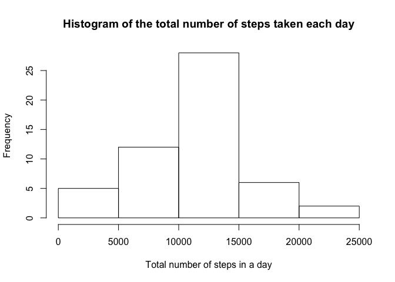
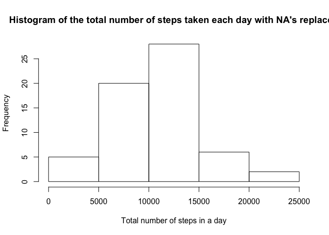
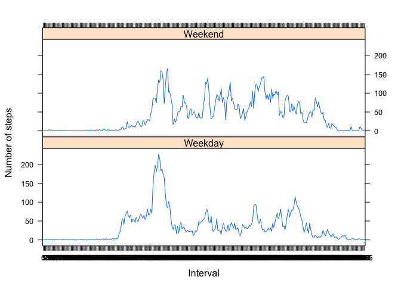

# Reproducible Research: Peer Assessment 1

December 2015

## Loading and preprocessing the data

First, load the activity monitoring data. The zip file must first be unzipped so that the .csv file of the data is available.


```r
input_data <- read.csv("activity.csv", header=TRUE)
```

## What is mean total number of steps taken per day?

1. Calculate the total number of steps taken per day:


```r
sum_steps <- aggregate(input_data$steps, by=list(date = input_data$date), FUN=sum, rm.na=TRUE)
```

2. Make a histogram of the total number of steps taken each day:


```r
hist(sum_steps[,2],
     main = "Histogram of the total number of steps taken each day",
     xlab = "Total number of steps in a day")
```

 

3. Calculate and report the mean and median of the total number of steps taken per day:


```r
summary(sum_steps[,2])
```

```
##    Min. 1st Qu.  Median    Mean 3rd Qu.    Max.    NA's 
##      42    8842   10770   10770   13300   21200       8
```
## What is the average daily activity pattern?

1. Make a time series plot of the 5-minute interval (x-axis) and the average number of steps taken, averaged across all days(y-axis). It is necessary to change the interval to a factor so that the naming will show up correctly on the plot:


```r
input_data$interval <- as.factor(input_data$interval)
interval_steps <- tapply(input_data$steps, input_data$interval, sum, na.rm=TRUE, simplify = TRUE)/length(levels(input_data$date))
plot(levels(input_data$interval), interval_steps, 
     type='l', 
     main="5-minute interval vs. average number of steps taken",
     xlab="5-minute interval", 
     ylab="Average number of steps taken")
```

 

2. Which 5-minute interval, on average across all the days in the data set, contains the maximum number of steps?


```r
names(which.max(interval_steps))
```

```
## [1] "835"
```
## Imputing missing values

1. Calculate and report the number of missing values in the data set:


```r
sum(is.na(input_data$steps))
```

```
## [1] 2304
```

2. Devise a strategy for filling in all of the missing values in the data set. The strategy does not need to be sophisticated. For example, you could use the mean/median for that day, or the mean for that 5-minute interval. In this case, I use the mean of the 5-minute interval:


```r
for (i in 1:length(input_data$steps)) {
  if (is.na(input_data$steps[i])) {
    for (j in 1:length(interval_steps)) {
      if (as.character(input_data$interval[i]) == names(interval_steps[j])) 
        input_data$steps[i] = interval_steps[j]
    }
  }
}
```

3. Create a new data set that is equal to the original data set but with the missing data filled in. Recall from the previous step that the input_data set was modified:


```r
new_data <- input_data
```

4. Make a histogram of the total number of steps taken each day and calculate and report the mean and median total number of steps taken per day. Do these values differ from the estimates from the first part of the assignment? What is the impact of imputing missing data on the estimates of the total daily number of steps?


```r
clean_data <- tapply(new_data$steps, new_data$date, sum, na.rm = TRUE, simplify = TRUE)
hist(clean_data, 
     main = "Histogram of the total number of steps taken each day with NA's replaced",
     xlab = "Total number of steps in a day")
```

 

There does seems to be a slight difference in this histogram and the histogram of the data without the NA's replaced. Let's take a look at the summary statistics of the new data set to see how it compares to the old:


```r
summary(clean_data)
```

```
##    Min. 1st Qu.  Median    Mean 3rd Qu.    Max. 
##      41    9354   10400   10580   12810   21190
```

Yes, there is a slight difference between the two data sets. Both the mean and the median have decreased in the new data set.

## Are there differences in activity patterns between weekdays and weekends?

1. Create a new factor variable in the data set with two levels – “weekday” and “weekend” indicating whether a given date is a weekday or weekend day.


```r
library(lubridate)
input_data$date <- as.Date(input_data$date, "%Y-%m-%d")

day <- weekdays(input_data$date)
daylevel <- vector()
for (i in 1:nrow(input_data)) {
  if (day[i] == "Saturday" || day[i] == "Sunday") {
    daylevel[i] <- "Weekend"
  } else {
    daylevel[i] <- "Weekday"
  }
}
input_data$daylevel <- daylevel
input_data$daylevel <- factor(input_data$daylevel)
```

2. Make a panel plot containing a time series plot (i.e. type = "l") of the 5-minute interval (x-axis) and the average number of steps taken, averaged across all weekday days or weekend days (y-axis). See the README file in the GitHub repository to see an example of what this plot should look like using simulated data.


```r
stepsDay <- aggregate(steps ~ interval + daylevel, data = input_data, mean)
names(stepsDay) <- c("interval", "daylevel", "steps")

library(lattice)
xyplot(steps ~ interval | daylevel, stepsDay, type = "l", layout = c(1, 2), 
       xlab = "Interval", ylab = "Number of steps")
```

 


